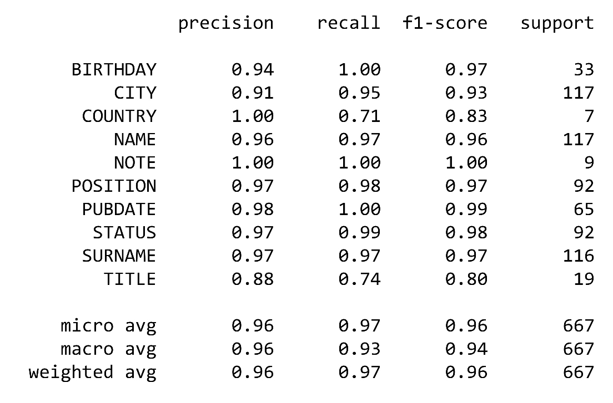

<!-- PROJECT LOGO -->
<br />
<p align="center">
  <a href="https://github.com/ReAlex1902/Innoscripta_task">
    
  </a>

  <h3 align="center">Hawk</h3>

  <p align="center">
    The decision to analyze a great number of documents with information about German top managers
  </p>
</p>


<!-- TABLE OF CONTENTS -->
<details open="open">
  <summary>Table of Contents</summary>
  <ol>
    <li>
      <a href="#about-the-project">About The Project</a>
      <ul>
        <li><a href="#built-with">Built With</a></li>
      </ul>
    </li>
    <li>
      <a href="#getting-started">Getting Started</a>
      <ul>
        <li><a href="#prerequisites">Prerequisites</a></li>
        <li><a href="#installation">Installation</a></li>
      </ul>
    </li>
    <li><a href="#usage">Usage</a></li>
    <li><a href="#metrics">Metrics</a></li>
    <li><a href="#license">License</a></li>
    <li><a href="#contact">Contact</a></li>
  </ol>
</details>


<!-- ABOUT THE PROJECT -->
## About The Project

[![Product Name Screen Shot][product-screenshot]](https://example.com)

Hawk project is supposed to help Innoscripta GmbH to work with the database in monitoring and scrapping necessary information about its counterparties.

Here are main reasons to use this decision:
* Hawk analyzes hundreds of documents for few minutes and highlights important information
* It is reliable according to the metrics on the validation dataset
* The neural network will save great amount of money on the routine analysis of documents

Of course, after some time Hawk will need to additioinal training. As it is applicable to every NN project, it needs new data to be kind of state-of-the-art decision for the company

### Built With

Hawk is created with the next technologies:
* [PyTorch](https://pytorch.org)
* [Hugging Face](https://huggingface.co/)
* [spaCy](https://spacy.io/)


<!-- GETTING STARTED -->
## Getting Started

In order to make Hawk work well you need to install all necessary prerequisites

### Prerequisites

Prerequisites are described in Production_code/requirements.txt. All you need is to run the next command \
The installation steps are already written in main.py script. Think of installation step if you're going to use Hawk outside of the script

### Installation

1. Download all necessary libraries with the next command:
  ```sh
  pip install -r requirements.txt
  ```
2. Download German spaCy large pipeline:
  ```sh
  python -m spacy download de_core_news_lg
  ```

<!-- USAGE EXAMPLES -->
## Usage

1. Download files from Prodution_code catalog. You will need requirements.txt to download, idf2tag.json for accurate predictions and main.py to be applied on the document.
2. Download [Hawk weights] (https://drive.google.com/file/d/1_IWXvjsV3uU0D93loeVUuK_miA24dt8b/view?usp=sharing).
3. Run main.py script.
4. When main.py asks you, provide the path to Hawk weights.
5. Write down the text of the document.
6. Enjoy the result!


## Metrics

As it was mentioned above, metrics are pretty high on the validation set. Here is the report:

<a href="https://github.com/ReAlex1902/Innoscripta_task">
  
</a>


<!-- LICENSE -->
## License

Distributed under the MIT License. See `LICENSE` for more information.


<!-- CONTACT -->
## Contact

Alex Malkhasov

E-mail: ReAlex1902@gmail.com \
[Telegram](https://t.me/ReAlex1902) \
[LinkedIn](https://www.linkedin.com/in/alex-malkhasov/)
