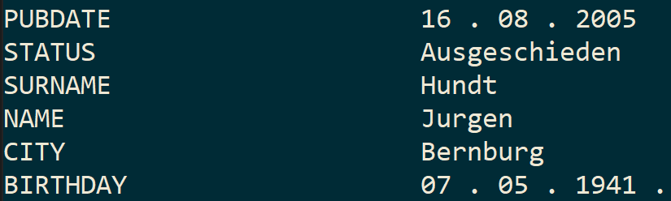

<!-- PROJECT LOGO -->
<br />
<p align="center">
  <a href="https://github.com/ReAlex1902/Hawk">
    
  </a>

  <h3 align="center">Hawk</h3>

  <p align="center">
    The decision to analyze a great number of documents with information about German top managers
  </p>
</p>


<!-- TABLE OF CONTENTS -->
<details open="open">
  <summary>Table of Contents</summary>
  <ol>
    <li>
      <a href="#about-the-project">About The Project</a>
      <ul>
        <li><a href="#built-with">Built With</a></li>
      </ul>
    </li>
    <li><a href="#analysis">Analysis</a></li>
    <li>
      <a href="#getting-started">Getting Started</a>
      <ul>
        <li><a href="#prerequisites">Prerequisites</a></li>
        <li><a href="#installation">Installation</a></li>
      </ul>
    </li>
    <li><a href="#usage">Usage</a></li>
    <li><a href="#metrics">Metrics</a></li>
    <li><a href="#license">License</a></li>
    <li><a href="#contact">Contact</a></li>
  </ol>
</details>


<!-- ABOUT THE PROJECT -->
## About The Project

Hawk project is supposed to help working with the text documents in finding necessary information (tags).

Here are main reasons to use this decision:
* Hawk analyzes hundreds of documents for few minutes and highlights important information
* It is reliable according to the metrics on the validation dataset
* The neural network will save great amount of money on the routine analysis of documents

Of course, after some time Hawk will need the additioinal training. As it is applicable to every NN project, it needs new data to be kind of state-of-the-art decision

### Built With

Hawk was created using the following technologies:
* [PyTorch](https://pytorch.org)
* [Hugging Face](https://huggingface.co/)
* [spaCy](https://spacy.io/)


## Analysis
You can find all steps in data analysis and modeling at [analysis/Hawk_modeling.ipynb](https://github.com/ReAlex1902/Hawk/blob/main/analysis/Hawk_modeling.ipynb)

### Data preprocessing steps:
1. [Large German Pipeline (de_core_news_lg)](https://spacy.io/models/de) is used for tagging texts.
2. All special symbols (including umlauts) are preprocessed.
3. DataFrmae is transformed to two lists with get_sents_and_tags function (sentences and tags). The first list contains texts divided to sentences, second list consists of tags for each word in the sentence.
4. tag2idx and idx2tag dictionaries are created once and used after training. They connect each tag to number, which will be predicted in the future. idx2tag.json is used in [src/predict.py](https://github.com/ReAlex1902/Hawk/blob/main/src/predict.py) to transform predicted number to tag.
5. With Bert Tokenizer text is tokenized with labels to each piece of the word using BILUO method.
6. Texts with labels are padded to a maximum length of 512 tokens.
7. Train and Validation Tensor Datasets and DataLoaders are created for training the model.

### Modeling steps:
1. I used [BertForTokenClassification bert-base-german-cased](https://huggingface.co/bert-base-german-cased) pretrained model.
2. train_model() function trains the model and return the history of loss function values. Here I used AdamW optimizer. eval_model() runs the model on the validation dataset and returns accuracy score, f1 score and classification report.
3. predict() prints the given sentence and highlights important information. The function in [src/predict.py](https://github.com/ReAlex1902/Hawk/blob/main/src/predict.py) is modified for everyday usage.




<!-- GETTING STARTED -->
## Getting Started

In order to make Hawk work well you need to install all necessary prerequisites

### Prerequisites

Prerequisites are described in [src/requirements.txt](https://github.com/ReAlex1902/Hawk/blob/main/src/requirements.txt). All you need is to follow the installation step.

### Installation

1. Clone Hawk github repository:
```sh
git clone https://github.com/ReAlex1902/Hawk.git
```
2. Go to Hawk repository and download all necessary libraries with the next command:
  ```sh
  cd Hawk
  python -m pip install -r src\requirements.txt
  ```
3. Download HAWK model (434 MB):
```sh
gdown --id 1_IWXvjsV3uU0D93loeVUuK_miA24dt8b --output src\HAWK_3.0.pth
```

<!-- USAGE EXAMPLES -->
## Usage

1. Run [src/main.py](https://github.com/ReAlex1902/Hawk/blob/main/src/main.py) script.
2. Write down the text of the document. example_document.txt is provided.
3. Enjoy the result!


## Metrics

As it was mentioned above, metrics are high on the validation set. Here is the report:


<!-- LICENSE -->
## License

Distributed under the MIT License. See `LICENSE` for more information.


<!-- CONTACT -->
## Contact

Alex Malkhasov

E-mail: ReAlex1902@gmail.com \
[Telegram](https://t.me/ReAlex1902) \
[LinkedIn](https://www.linkedin.com/in/alex-malkhasov/)
